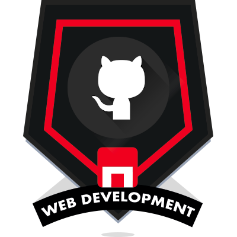

### Hi there 👋

<!--
**Neivajg/Neivajg** is a ✨ _special_ ✨ repository because its `README.md` (this file) appears on your GitHub profile.

Here are some ideas to get you started:

- 🔭 I’m currently working on ...
- 🌱 I’m currently learning ...
- 👯 I’m looking to collaborate on ...
- 🤔 I’m looking for help with ...
- 💬 Ask me about ...
- 📫 How to reach me: ...
- 😄 Pronouns: ...
- ⚡ Fun fact: ...
-->
<!-- # Hi there 	&#128075;&#127996;, I'm Neiva	 	&#128105;&#127995;&#8205;&#128188; :computer:  -->

 
 

### My abilities:
#### Press CTRL + click on the image to see the credential

<a href="https://dev.mysql.com/doc/" target="_blank" rel="noreferrer">
<a href="" target="_blank" rel="noreferrer">

<!-- ## Codewars JavaScript Level:

  -->
 
 ## My Statistics
 

## 

## Streak

##

## Contact:

 <a href="https://www.linkedin.com/in/neivajg/" target="_blank" rel="noreferrer">

<a href="mailto:neiva9.6@hotmail.com.com">neiva9.6@hotmail.com</a>

